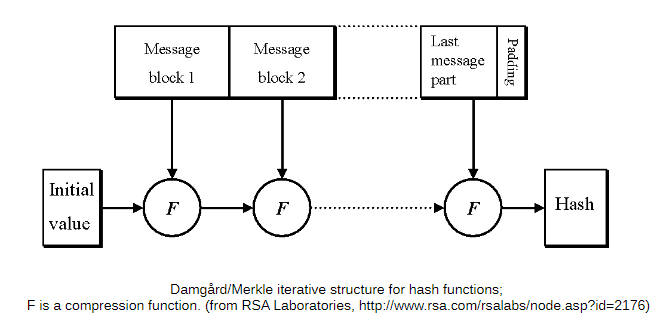

# Error Detection with Hash Functions

## Question 1 (10 marks)

Define what is meant by a hash function as used for error detection.

## Answer 1

A hash function is a mathematical algorithm that takes an input (or message) and returns a fixed-size string of bytes, typically a hash value. The purpose of a hash function for error detection is to ensure data integrity by comparing the computed hash of the original data with a received or stored hash. Any changes in the data, intentional or accidental, will result in a different hash value, thereby detecting errors.

Passwords are stored securely by hashing them, which means converting the password into a fixed-size value using a mathematical algorithm. This hash is stored, not the actual password. When you log in, the system hashes the password you enter and compares it to the stored hash. If they match, you’re authenticated. A key property of hash functions is that they always produce the same output for the same input, ensuring consistent verification. Hashing also makes it nearly impossible to reverse the hash to find the original password, adding an extra layer of security.

## Question 2 (25 marks)

Draw a diagram showing the general structure of a hash function (in paint, word, or on paper and take a picture of it). Also explain how the message is processed to compute the hash value.

## Answer 2

The diagram below illustrates the general structure of a hash function:

The message is processed to compute the hash value through the following steps:

1. **Padding**: The original message is padded to ensure its length is a multiple of a fixed block size. Padding typically involves appending a single '1' bit followed by a series of '0' bits and the length of the original message.

2. **Splitting**: The padded message is split into fixed-size blocks. Each block is processed sequentially.

3. **Initialization**: An initial hash value is set. This value is often a predefined constant.

4. **Processing**: Each block is processed using a series of bitwise operations, permutations, and logical functions. This involves:
   - Combining the block with the current hash value.
   - Applying a series of transformations (e.g., bitwise operations, modular additions, and permutations) to mix the bits thoroughly.
   - Updating the hash value with the result of these transformations.

5. **Finalization**: After all blocks have been processed, the final hash value is produced. This value is typically a fixed-size string of bytes.

6. **Output**: The final hash value is output as the result of the hash function.

These steps ensure that even a small change in the input message will produce a significantly different hash value, making hash functions effective for error detection and data integrity verification.

## Question 3 (4 marks)

The MD5 hash function gives a hash value of what size?

Select one:

1. Don't know  
1. 384 bits  
1. 128 bits  
1. 512 bits  
1. 256 bits

## Answer 3

128 bits

## Question 4 (2 marks)

Hash functions allow you to correct errors in data.

Select one:

1. Don't know  
1. FALSE  
1. TRUE  

## Answer 4

FALSE.
